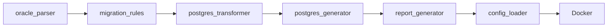

# Oracle2PostgreSQL 設計書

| 項目 | 内容 |
|---|---|
| 文書名 | Oracle2PostgreSQL 設計書 |
| バージョン | 1.0 |
| 作成日 | 2026-05-12 |
| 対象システム | Python GUI / CLI / Docker |
| 配置 | `docs/設計書.md` / `docs/設計書.xlsx` |

## 1. はじめに

本書は、`Oracle2PostgreSQL` の目的、構成、機能、データ、セキュリティ、運用観点を引継ぎ可能な粒度で整理する設計書である。

## 2. システム概要

Oracle SQL / PL/SQL を AST ベースで PostgreSQL 互換 SQL へ変換する移行ツール

### 2.1 利用者

- DB 移行担当
- DBA
- アプリ開発者
- レビュー担当

### 2.2 スコープ内

- Oracle SQL/PLSQL 解析
- 80+ 変換ルール
- PostgreSQL SQL 生成
- HTML/CSV レポート
- GUI/CLI/Docker 実行
- YAML 設定

### 2.3 スコープ外

- 本番 DB への自動適用
- 全 PL/SQL 互換性保証
- 性能チューニング完了保証

## 3. アーキテクチャ

### 3.1 技術スタック

| 区分 | 採用技術 | 用途 |
|---|---|---|
| Python | requirements.txt | PyYAML>=6.0, pyinstaller>=6.0, pytest>=7.0, pytest-cov>=4.0 |
| Python package | pyproject.toml | パッケージ/依存関係/エントリーポイント定義 |
| Docker | containerized execution | Dockerfile / docker-compose.yml |

### 3.2 主要ファイル

| パス | 役割 |
|---|---|
| `.dockerignore` | 主要ソース/設定ファイル |
| `config.yaml` | 設定 |
| `design_document.xlsx` | 主要ソース/設定ファイル |
| `docker-compose.yml` | 主要ソース/設定ファイル |
| `Dockerfile` | 主要ソース/設定ファイル |
| `generate_design_doc.py` | 主要ソース/設定ファイル |
| `main.py` | 主要ソース/設定ファイル |
| `Oracle2PostgreSQL.spec` | 主要ソース/設定ファイル |
| `pyproject.toml` | 設定 |
| `README.md` | 利用方法・概要 |
| `requirements.txt` | 主要ソース/設定ファイル |
| `test_conversion.py` | テスト |
| `logs/test_integration.log` | テスト |
| `oracle2pg.egg-info/dependency_links.txt` | 主要ソース/設定ファイル |
| `oracle2pg.egg-info/entry_points.txt` | 主要ソース/設定ファイル |
| `oracle2pg.egg-info/PKG-INFO` | 主要ソース/設定ファイル |
| `oracle2pg.egg-info/requires.txt` | 主要ソース/設定ファイル |
| `oracle2pg.egg-info/SOURCES.txt` | 主要ソース/設定ファイル |
| `oracle2pg.egg-info/top_level.txt` | 主要ソース/設定ファイル |
| `samples/01_create_tables.sql` | 主要ソース/設定ファイル |

## 4. データ・設定モデル

| データ | 形式 | 説明 |
|---|---|---|
| 入力 | .sql/.pls | Oracle DDL/DML/PLSQL |
| 設定 | config.yaml | ルール ON/OFF、スキーママッピング、ログ |
| 出力 | _pg.sql + report | PostgreSQL SQL、HTML/CSV レポート |

## 5. 機能仕様

| ID | 機能 | 仕様 |
|---|---|---|
| F-01 | AST 解析 | CREATE/PLSQL ブロックを構造化して解析する。 |
| F-02 | ルール変換 | 型、関数、構文、トリガー等を PostgreSQL 方言へ変換する。 |
| F-03 | 生成 | 変換済み SQL と関数/トリガー定義を出力する。 |
| F-04 | レポート | AUTO/REVIEW/MANUAL の重要度付き変更一覧を出力する。 |

## 6. セキュリティ・品質

- DB スキーマ・業務ロジックをローカルまたは管理された Docker 内で処理する。
- MANUAL/REVIEW 項目を本番適用前のゲートにする。

## 7. デプロイ・運用

- python main.py で GUI/CLI
- docker-compose で検証環境起動
- test_conversion.py と CI で主要変換を確認

## 8. 既知の制約と今後の拡張

- 自動変換・自動判定を含む機能は、利用者または担当者レビューを前提とする。
- 本番利用前に対象データ、権限、ログ、バックアップ、例外処理を運用環境に合わせて確認する。
- README と実装差分が出た場合は、実装側を正として本書を更新する。

## 付録 A. 改訂履歴

| 版 | 日付 | 内容 |
|---|---|---|
| 1.0 | 2026-05-12 | 初版作成 |
